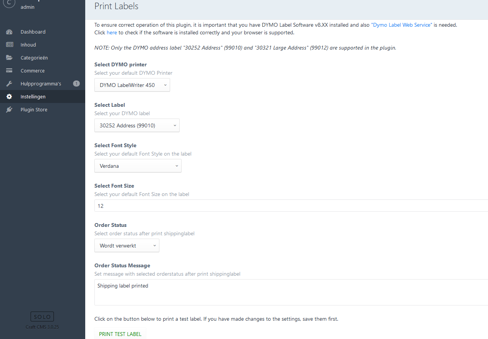

# Print DYMO shipping labels plugin for Craft CMS 3.x

With this plugin you can easily print shipping labels with a DYMO label printer. This plugin will save you a lot of time. With just one click the shipping address is printed on a label.

## Requirements
This plugin requires 
- Craft CMS 3.0.0 or later.
- Craft Commerce 2
- DYMO LabelWriter 400 / DYMO LabelWriter 450

To ensure correct operation of this plugin, it is important that you have DYMO Label Software v8.XX installed and also ["Dymo Label Web Service"](http://www.dymo.com/en-US/online-support/dymo-user-guides) is needed. 
You must have a DYMO LabelWriter 400 or 450 series connected directly to your computer.

Click [here](http://labelwriter.com/software/dls/sdk/samples/js/CheckEnvironment/CheckEnvironment.html) to check if the software is installed correctly and your browser is supported.  

## Installation

To install the plugin, follow these instructions.

1. Open your terminal and go to your Craft project:

        cd /path/to/project

2. Then tell Composer to load the plugin:

        composer require webburo-spring/craft-printlabels

3. In the Control Panel, go to Settings → Plugins and click the “Install” button.

## Configuring DYMO shipping label plugin

Use the plugin settings page to select the installed DYMO labelprinter, select label, set font style and font size.
You can also select a shipping status (including message) where the order should be set after printing the label.

NOTE: Only the DYMO address label "30252 Address" (99010) and "30321 Large Address" (99012) are supported in the plugin..

## Using DYMO shipping label plugin

A button has been added to the order page to print a shipping label. If this button is not present, no DYMO LabelWriter has been configured in the settings.

If the order status is set in the settings, the order will be changed to the selected status. (including message, if set).
NOTE: Order status will be changed, also when the label is not printed correctly or the DYMO could not be found!

Happy printing! :-)
